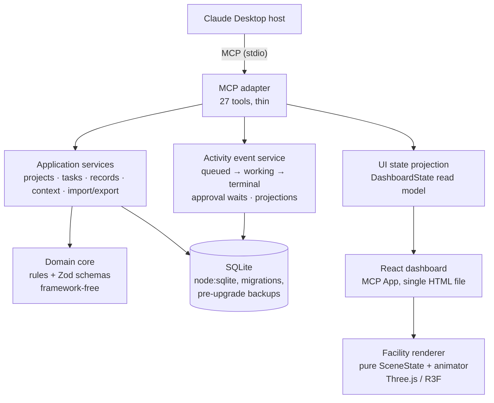

# Claude Mission Control

A local-first project workspace for Claude Desktop. Claude gets structured tools for projects,
tasks, decisions, checkpoints, and handoffs; you get a dashboard with a low-poly isometric
facility where a small robot truthfully acts out every Mission Control operation.

> **Status:** Version 0.1.0. All ten build phases complete; installed and verified on Claude
> Desktop (Windows 11). Independent portfolio project — not affiliated with or endorsed by
> Anthropic.

- **One-click install** — a single `.mcpb` file. No API key, no Node/Python, no config editing.
- **Local-first** — everything lives in a SQLite database in your user profile. No cloud, no
  telemetry, no network access.
- **Truthful by construction** — the visualization renders only persisted tool events and saved
  project state. It never claims to show Claude's reasoning, and unknown progress stays unknown.

## What it does

Ask Claude things like:

> "Create a project called Demo with the goal of shipping v1, and plan the first tasks."
> "Record the decision to use SQLite, with the alternatives we discussed."
> "Save a checkpoint so we can continue tomorrow." — then, in a new conversation:
> "Get the latest checkpoint and prepare the project context."

Claude uses 27 Mission Control tools; every call becomes a persisted activity event. The
dashboard (opened with _"open Mission Control"_) shows the project header and stage bar, an exact
activity panel, an event timeline, task/decision/checkpoint views — and the facility, where the
robot dispatches from the Command Core, works in the department that matches the operation, and
waits at the Security Gate whenever a bulk or destructive change needs your approval.

Try the layout in a plain browser: `npm run build:dashboard`, then
`node poc/scripts/serve-dashboard.mjs` and open `http://localhost:5181/?demo` (clearly labeled
sample data). A ready-to-import example project lives in
[`examples/demo-project.json`](examples/demo-project.json).

## Monitor window

Want Mission Control visible the whole time Claude works, outside the chat?

**Easiest (Windows):** double-click **`start-monitor.cmd`** in this folder, or create a desktop
shortcut to it (the first run installs dependencies and builds the dashboard, then every run just
opens the window). Keep the black console window open while you want the monitor running; close it
to stop.

**From a terminal (any platform):**

```bash
npm run monitor
```

Either way, a **read-only monitor window** opens in your browser at `http://127.0.0.1:8642/?monitor`
(loopback only). It reads the shared local database directly and live-updates as Claude uses
Mission Control tools — independent of Claude Desktop's conversation lifecycle, so it stays up
across restarts and new chats. Changes are made in the conversation; the monitor is a pure
observer.

Keep it on a second screen and add a line like _"keep Mission Control updated as you work"_ to your
projects' instructions so the facility reflects progress continuously. (`CMC_MONITOR_PORT` changes
the port; `--no-open` skips launching the browser.)

## Install

See [`docs/INSTALL.md`](docs/INSTALL.md). Short version: build with `npm run release`, then in
Claude Desktop go to Settings → Extensions → Advanced settings → Install Extension and pick
`dist/claude-mission-control.mcpb`.

## Architecture



- **Domain core** (`packages/domain`) — records, rules, and the event state machine. Imports no
  framework; ESLint fails the build if it tries.
- **Server** (`packages/server`) — application services, SQLite storage, the activity/event
  layer, and the MCP adapter. Every tool validates input and returns a stable
  `{ ok, error: { code, message, recovery } }` contract.
- **UI** (`packages/ui`) — the dashboard and the 3D facility. It receives a read-only projection
  and animates a pure, unit-tested scene state; ambient motion is never presented as work.

Key architectural decisions are recorded in [`docs/DECISION_LOG.md`](docs/DECISION_LOG.md)
(D-001 through D-026). The eight end-to-end workflows are documented in
[`docs/WORKFLOWS.md`](docs/WORKFLOWS.md).

## Honesty model

The facility is an interface for verified events, not an AI mind reader
([`docs/MCP_OBSERVABILITY_MODEL.md`](docs/MCP_OBSERVABILITY_MODEL.md)):

- Rooms activate only for persisted Mission Control events; idle says
  _"Waiting for the next observable Mission Control activity."_
- Progress appears only when an operation explicitly reports countable steps, or as
  _project_ progress computed from saved task data.
- Failures stay visible with their exact stable error code; cancellation is distinct from
  success and failure.
- A preview is never shown as completed work — it waits, amber, at the Security Gate.

## Polish goals (planned, tracked in Mission Control itself)

- Per-department robot work animations (unique gestures and props per room).
- Multiple robot instances for concurrent operations.
- In-dashboard approve/reject buttons for Security Gate previews.
- Push-based live updates below the current 2.5 s poll.
- macOS hardware verification.

## Known limitations

- **Host compatibility moves fast.** MCP Apps support in Claude Desktop is new; re-verify after
  app updates (an earlier host version did not surface extension tools in chat — documented in
  [`poc/README.md`](poc/README.md)).
- Live updates use 2.5-second polling, so the facility reacts within a few seconds, not
  instantly. Fast consecutive operations are replayed sequentially (queue capped; the timeline
  is always authoritative).
- One robot, by design (D-011). In-dashboard approval buttons are deferred — approvals happen in
  the conversation.
- macOS is expected to work (no native dependencies) but has not been tested on hardware.

## Development

```bash
npm install
npm run verify     # typecheck + lint + format + 146 tests
npm run release    # build bundle + stdio smoke test + pack .mcpb
npm run mcp:inspect  # interactive tool testing with MCP Inspector
```

Full guide: [`docs/DEVELOPMENT.md`](docs/DEVELOPMENT.md). CI runs the whole pipeline — including
a smoke test that drives the packed bundle exactly the way Claude Desktop launches it — on
Windows and Linux.

## Project documentation

| Document                                                             | Purpose                         |
| -------------------------------------------------------------------- | ------------------------------- |
| [`docs/PROJECT_BRIEF.md`](docs/PROJECT_BRIEF.md)                     | Approved product brief          |
| [`docs/PRODUCT_REQUIREMENTS.md`](docs/PRODUCT_REQUIREMENTS.md)       | Version 1 scope                 |
| [`docs/SYSTEM_ARCHITECTURE.md`](docs/SYSTEM_ARCHITECTURE.md)         | Modules and data flow           |
| [`docs/VISUAL_DESIGN.md`](docs/VISUAL_DESIGN.md)                     | Facility and UI design          |
| [`docs/MCP_OBSERVABILITY_MODEL.md`](docs/MCP_OBSERVABILITY_MODEL.md) | What may be displayed           |
| [`docs/TOOL_AND_EVENT_MODEL.md`](docs/TOOL_AND_EVENT_MODEL.md)       | Tool and event contracts        |
| [`docs/WORKFLOWS.md`](docs/WORKFLOWS.md)                             | End-to-end scenarios            |
| [`docs/INSTALL.md`](docs/INSTALL.md)                                 | Install, update, uninstall      |
| [`docs/DEVELOPMENT.md`](docs/DEVELOPMENT.md)                         | Developer guide                 |
| [`docs/DECISION_LOG.md`](docs/DECISION_LOG.md)                       | Architectural decisions         |
| [`docs/IMPLEMENTATION_ROADMAP.md`](docs/IMPLEMENTATION_ROADMAP.md)   | The ten build phases            |
| [`docs/PORTFOLIO_NOTES.md`](docs/PORTFOLIO_NOTES.md)                 | Resume bullets, interview notes |
| [`CHANGELOG.md`](CHANGELOG.md)                                       | Release notes                   |

## History

Built phase-by-phase by Claude under the engineering contract in [`CLAUDE.md`](CLAUDE.md):
platform proof (Phase 0, kept in [`poc/`](poc/README.md)), repository foundation, domain and
database, MCP tools, event layer, dashboard, static facility, event-driven animation, end-to-end
workflows, packaging, and this polish pass. Each phase ended with tests, CI, and a review stop.

## License

[MIT](LICENSE)
